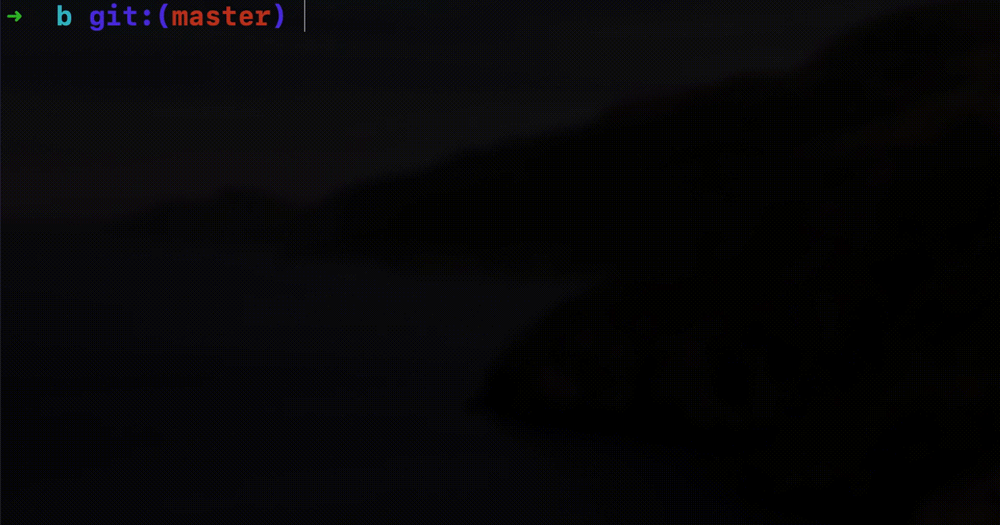

# B

👩‍💻 A very simple programming language. Created for practise purposes.



## Interpreter

### Interactive Mode

The interpreter CLI ships with an interactive mode that can be used to play around with the language:

```
git clone git@github.com:kvendrik/b.git && cd b && yarn && yarn build

./b
v1.0.0-alpha
>>> count = 2;
>>> multiply = {(x, y) x * y};
>>> multiply(count, 2);
4
>>> exit
```

### Using files

You can also use files by passing the file path into the CLI.

`examples/simple-program.b`

```
iteration = 0;

while(iteration < 100, {()
  iteration = iteration + 1;

  if(iteration == 50, {() log("Halfway!")});

  message = concat("Currently at: ", iteration);
  log(message);
});
```

```
./b ./examples/simple-program.b
Currently at: 1
Currently at: 2
Currently at: 3
Currently at: 4
Currently at: 5
...
```

### Programmatically

If you'd like to play around with the parser and/or interpreter in code you can install the package using its Github URL:

```
yarn add https://github.com/kvendrik/b
```

```ts
import {Interpreter, toAST} from 'b';

const ast = toAST(`
  count = 2;
  multiply = {(x, y) x * y};
  multiply(count, 2);
`);

const interpreter = new Interpreter();

console.log(interpreter.evaluate(ast)); // {type: 'Number', value: '4'}
```

## Why

I created this for practise purposes. I wanted to learn more about the inner workings of lexers, parsers, and interpreters. It seems like a good way to do so was by writing my own.

It's all written in JS which, depending on what it's used for, might not be what I would write this in if used in a production scenario, but it works well for practise purposes.

## Is it [Turing Complete](https://en.wikipedia.org/wiki/Turing_completeness)?

Yes it supports more than the bare minimum you need for turing completeness. It wouldn't be easy to implement a complex program in this though so I'd probably classify it as a [Turning tarpit](https://en.wikipedia.org/wiki/Turing_tarpit).

Typically a language is considered turing complete if a program can either be compiled to a language that has already been proven to be turing complete or if a working turing machine simulator can be written in the language.

Below you'll find the code for a working turing machine simulator. The expected result for the entered program is `[1, 1, 1, 0, 1, 1, 1]`. You can run this locally by giving the file to the interpreter CLI:

```
./b ./examples/turing-machine.b
```

```

```

## Features

- [x] Basic math operations
- [x] String & Number literals
- [x] Variable assignments
- [x] Function expressions & assignments
- [x] Function calls
- [x] Multiline support
- [x] Scoped variables
- [x] Conditional logic
- [x] Loops
- [x] Using function expressions as function arguments
- [x] Scoped functions
- [x] Loop continues and returns without value (using `break` keyword)
- [x] Using function calls directly as function arguments
- [ ] Early returns with value
- [ ] Line and character numbers in error messages
- [ ] Chained math operations (not implemented in interpreter yet e.g. `2 + 2 * 4 / 2`)
- [ ] Priority groups (e.g. `(2 + 2) * 2`)
- [ ] Arrays
